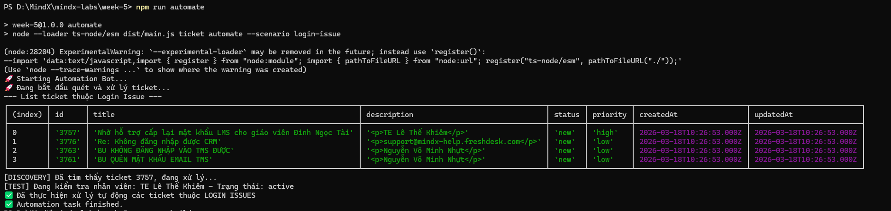
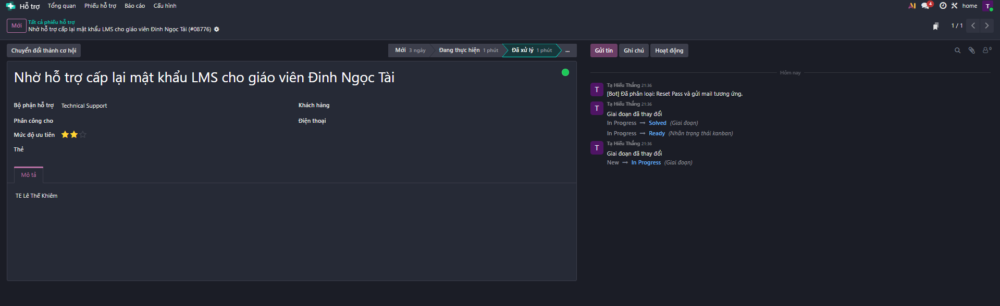

# Week 5 Tasks: Reporting, Analysis & Automation

# I. Days 1-2: Reporting & Analysis

## 1. Odoo Reporting Overview

Dựa trên các công cụ báo cáo của Odoo, em đã trích xuất dữ liệu dựa trên **131 tickets** được import từ hệ thống thực tế.

### Key Visualizations:

- **Category Distribution (Pie Chart):** Phân tích tỷ trọng các loại lỗi dựa trên Tag.  
- **Priority Distribution (Bar Chart):** Đánh giá mức độ khẩn cấp của các vấn đề.  
- **Trend Analysis:** Theo dõi biến động lượng ticket theo thời gian xử lý.  

---

## 2. Top 5 Recurring Issues Identify (Phân tích lỗi lặp lại)

Dựa vào thống kê số lượng (Count) từ cao xuống thấp trong biểu đồ Tag, tôi xác định 5 nhóm lỗi trọng tâm:

| Issue Category (Tag)   | Ticket Count | Primary Impact |
|------------------------|--------------|----------------|
| CRM Issues             | ~28          | Gián đoạn quy trình kinh doanh, không chốt được Lead. |
| LMS (Login/Access)     | ~14          | Học viên không thể vào học, gây bức xúc cao. |
| TMS (Training Mgmt)    | ~11          | Lỗi dữ liệu vận hành lớp học. |
| Bug/System Error       | ~5           | Các lỗi kỹ thuật phát sinh đột xuất. |
| E-learning Content     | ~3           | Ảnh hưởng trực tiếp đến trải nghiệm người dùng. |

---

## 3. Impact Assessment (Đánh giá tác động)

### 3.1. Phân tích mức độ ưu tiên (Priority)

Dựa trên biểu đồ Priority (`Screenshot 2026-03-19 105213.png`), ta thấy:

- **Urgent (Khẩn cấp):**
  - Chiếm ~40 tickets  
  - Đây là những lỗi cần xử lý ngay lập tức để tránh thiệt hại về doanh thu  

- **High/Medium:**
  - Chiếm đa số (~80 tickets)  
  - Gây tắc nghẽn luồng xử lý của Operating Engineer nếu làm thủ công  

---

### 3.2. Ước tính lãng phí thời gian (Time Spent)

- **Thao tác thủ công:**
  - Trung bình **10 phút/ticket**

- **Tổng thời gian lãng phí:**
  - Riêng nhóm CRM và LMS (~42 tickets)  
  - → Tổng thời gian mất là **420 phút (~7 giờ làm việc)** mỗi chu kỳ lỗi lặp lại 

## 4. Deliverables (Minh chứng đính kèm)

**Báo cáo phân loại lỗi (Tag Chart):**

|  |  |
|--|--|
|  |  |

**Báo cáo mức độ ưu tiên (Priority Chart):**

|  |  |
|--|--|
|  |  |

# II. Days 3-4: Automation Implementation

## 1. Objective

Triển khai giải pháp tự động hóa theo tư duy **Operating Engineer** để xử lý các Ticket thuộc nhóm **"Login Issue"** (Vấn đề đăng nhập) được xác định từ giai đoạn trước.

---

## 2. Task: Scenario 1 - Login Issue Automation

- **Selected Issue:** Khôi phục tài khoản và cấp lại mật khẩu.  
- **Pattern:** Tài khoản bị khóa tự động sau 30 ngày không hoạt động (Luật hệ thống).  
- **Operating Engineer Approach:** Thay vì can thiệp sửa mã nguồn (Core) của hệ thống LMS để thay đổi luật 30 ngày (tốn thời gian và rủi ro bảo mật), chúng ta xây dựng script tự động hóa để “quét” và xử lý hậu quả ngay khi có yêu cầu từ người dùng.

---

## 3. Documentation of Automation Workflow

### 3.1. Understand the Problem

- **Vấn đề:** Nhân viên thường xuyên gửi ticket yêu cầu cấp lại mật khẩu do tài khoản bị hệ thống tự động deactivate sau 30 ngày.  

- **Tại sao chọn Automation thay vì Code Fix:**
  - **Bảo mật:** Giữ nguyên quy tắc 30 ngày để đảm bảo an toàn hệ thống.  
  - **Tốc độ:** Script automation có thể triển khai ngay mà không cần chờ quy trình Deploy phức tạp của Core Team.  
  - **Chi phí:** Giảm thời gian xử lý thủ công từ 10-15 phút/ticket xuống còn ~ 5 giây/ticket.  

---

### 3.2. Automation Design & Structure

Hệ thống được thiết kế theo cấu trúc **Adapter Pattern** để dễ dàng mở rộng:

- **OdooAdapter:** Giao tiếp với Odoo API (JSON-RPC) để lấy và cập nhật ticket.  
- **HRAdapter:** Giả lập kết nối hệ thống nhân sự để kiểm tra trạng thái nhân viên.  
- **NodemailerAdapter:** Sử dụng Nodemailer để gửi phản hồi tự động.  
- **TicketService:** Chứa logic nghiệp vụ cốt lõi (Phân loại & Ra quyết định).

---

### 3.3. Implementation Details

#### Step 1: Ticket Analysis (Nhận diện)

Sử dụng Regex kết hợp hệ thống tính điểm (**Score >= 1.5**) để lọc các ticket liên quan đến đăng nhập, loại bỏ các ticket spam hoặc yêu cầu tính năng:

```ts
const loginKeywords = /mật khẩu|password|login|đăng nhập|reset/i
// Logic tính điểm cộng dồn để đảm bảo độ chính xác
if (/cấp lại mật khẩu|quên mật khẩu|reset password/i.test(content)) score += 2
```

#### Step 2: HR System Check (Xác minh)

Bot tự động bóc tách tên/email từ description (đã qua xử lý làm sạch HTML rác từ Odoo Editor) để truy vấn trạng thái nhân viên:

- Nếu `status === "active"`: Tiếp tục xử lý.
- Nếu `status === "resigned"` hoặc `not found`: Ghi chú vào ticket để HR review thủ công.

#### Step 3: Decision & Action (Xử lý)

- **Phân loại Case**: Tự động nhận diện giữa yêu cầu Reset mật khẩu và Cấp lại tài khoản dựa trên Title.
- **Cập nhật Odoo**: Chuyển trạng thái Ticket: `New` → `In Progress` → `Resolved`.
- **Gửi Email**: Gửi hướng dẫn cụ thể theo từng trường hợp (Mật khẩu mặc định hoặc thông tin tài khoản).

### 3.4. Odoo Integration & Trigger

- **Phương thức tích hợp**: Sử dụng Odoo API qua giao thức JSON-RPC.
- **Trigger**: Hiện tại script đang được thiết lập chạy theo lịch trình (Scheduled Check).
- **Hướng phát triển**: Có thể tích hợp Webhook từ Odoo để đạt trạng thái Real-time Automation (xử lý ngay khi ticket vừa tạo).

## 4. Demo & Evidence

**Case 1: Xử lý thành công (Employee Active)**

- Dạng Ticket: "QUÊN MẬT KHẨU EMAIL TMS" hoặc "CẤP LẠI TÀI KHOẢN ECOUNT".
- Dữ liệu đầu vào: Nhân viên `TE Lê Thế Khiêm` (Active).
- Hành động của Bot: * Xác nhận nhân viên đang làm việc -> Chuyển trạng thái ticket từ `New` → `In Progress` → `Resolved` -> Gửi Email thành công
- Bằng chứng (Screenshot)
  - Kết quả script terminal

   

  - Odoo Ticket Chatter ghi chú các hành động automation

   

  - Email phản hồi

   

**Case 2: Từ chối xử lý tự động (Employee Resigned)**

- Dạng Ticket: Bất kỳ ticket nào thuộc loại Login Issue.
- Dữ liệu đầu vào: Nhân viên có trạng thái `resigned` trên hệ thống HR.
- Hành động của Bot: * Nhận diện nhân viên đã nghỉ việc -> Dừng tiến trình tự động để đảm bảo bảo mật -> Cập nhật Note vào ticket: "Tình trạng nhân viên 'đã nghỉ việc', cần bộ phận HR review thủ công" -> Gửi Email thông báo Case `EMPLOYEE_RESIGNED`
- Bằng chứng (Screenshot)
  - Odoo Ticket Chatter ghi chú các hành động automation

   

  - Email phản hồi

   

---